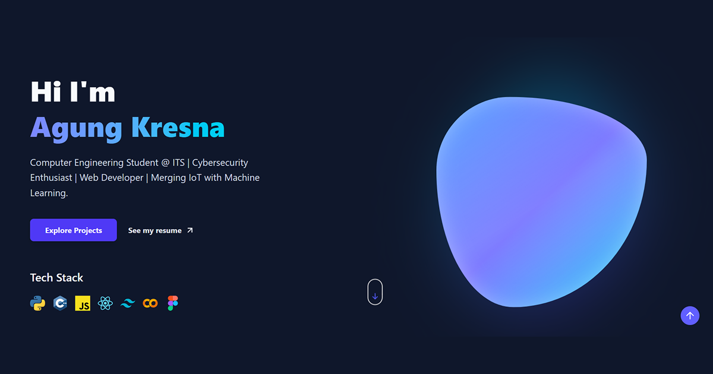

# 🎨 Kresnanta's Portfolio


## 📝 Short Description

A modern, responsive portfolio website showcasing web development skills and projects. Built with **React**, **Vite**, and **Tailwind CSS** to demonstrate expertise in full-stack development, UI/UX design, and modern web technologies. This personal portfolio serves as a professional online presence and platform to display completed projects.



---

---

## 📁 Project Structure

```
myWebsite/
├── src/
│   ├── component/                    # React components (navbar, hero, about, etc.)
│   ├── assets/                       # Images, SVGs, and media files
│   └── Configuration files           # App.jsx, main.jsx, styling files
├── public/                           # Static assets
├── backend/                          # Node.js server and API routes
└── Configuration & Docker files      # vite.config.js, tailwind.config.js, Dockerfile, etc.
```

---

## 🚀 Installation Guide

### Prerequisites
- **Node.js** v18 or higher - [Download here](https://nodejs.org/)
- **npm** v9+ or **yarn** v3+
- **Git** - [Download here](https://git-scm.com/)
- **Docker** (optional) - [Download here](https://www.docker.com/)

### Docker Compose (Steps)
1. **Start Services**  
  ``` bash
  $ docker-compose up -d --build
  ```

2. **Access Services**  
Frontend : `http://localhost:5173`  
Backend  : `http://localhost:5000`  
Adminer  : `http://localhost:8080` (DB Management)


3. **Initial DB Setup**  
Login to Adminer and run the following query to create the table:
```sql
CREATE TABLE contacts (
  id INT AUTO_INCREMENT PRIMARY KEY,
  name VARCHAR(100), email VARCHAR(100),
  subject VARCHAR(200), message TEXT,
  created_at TIMESTAMP DEFAULT CURRENT_TIMESTAMP
);
CREATE TABLE projects (
  id INT AUTO_INCREMENT PRIMARY KEY,
  title VARCHAR(255) NOT NULL,
  description TEXT,
  tags VARCHAR(255),
  image_url TEXT,
  live_demo VARCHAR(255),
  source_code VARCHAR(255),
  created_at TIMESTAMP DEFAULT CURRENT_TIMESTAMP
);
```

---

## ✨ Current Features

- Smooth & modern UI with interactive components
- Fully responsive design (mobile, tablet, desktop)
- Dark mode toggle
- Database for storing projects & contact form responses
- Telegram notifications for contact form submissions
- SEO optimized with proper metadata

---

## 📜 Available Scripts

| Command | Description |
|---------|------------|
| `npm run dev` | Start development server with HMR (Hot Module Replacement) |
| `npm run build` | Build optimized production bundle in `dist/` |
| `npm run preview` | Preview the production build locally |
| `npm run lint` | Run ESLint to check code quality |
| `docker-compose restart backend` | Restart node.js server after changes |
| `docker logs -f web_porto_backend` | Monitor backend logs |
| `docker logs -f web_porto_frontend` | Monitor frontend logs |

---

## 📝 License

This project is a personal portfolio and is available for educational purposes.

---

## 📧 Contact & Connect

For inquiries or collaboration opportunities, feel free to reach out through the contact form on the website.

---

**Last Updated**: February 2026  
**Version**: 0.0.0 (Development)
